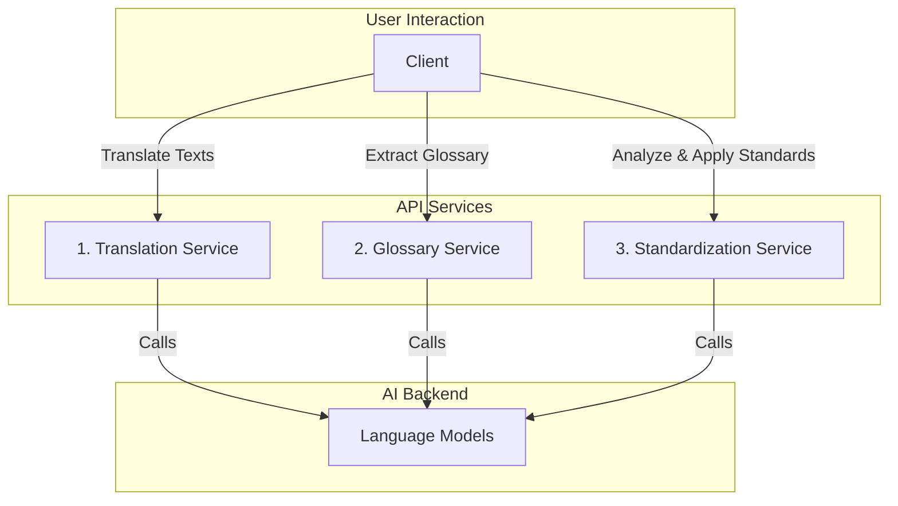

# LangGraph Buddhist Text Translation API

[](./docs/API_REFERENCE.md)
[](./tests)
[](./docs/README.md)

A sophisticated, multi-stage API for translating, analyzing, and standardizing Tibetan Buddhist texts. This project uses a modular, streaming-first architecture built with FastAPI and LangGraph to provide a flexible and powerful pipeline for high-quality, consistent translations.

---

### Key Features

-   **Modular Workflow**: A decoupled three-stage pipeline for Translation, Glossary Extraction, and Standardization.
-   **Streaming First**: Real-time events for all long-running operations, providing a transparent and interactive user experience.
-   **Intelligent Standardization**: A powerful suite of tools to analyze and enforce terminological consistency across large datasets.
-   **Multi-Model Support**: Dynamically route requests to models from Anthropic, OpenAI, and Google.
    - Anthropic (exact IDs only): `claude-3-7-sonnet-20250219`, `claude-3-5-sonnet-20241022`, `claude-sonnet-4-20250514`, `claude-3-5-haiku-20241022`, `claude-3-opus-20240229`.
    - Google: `gemini-2.5-pro`, `gemini-2.5-flash`, `gemini-2.5-flash-thinking` (virtual alias; same underlying model with thinking enabled).
-   **Performance Optimized**: In-memory caching for repeated requests and parallel, batched processing for glossary and standardization tasks.
-   **Comprehensive Documentation**: Includes a full API reference, an architectural overview, and a guide to the project's evolution.

---

### Architecture: A Decoupled, Multi-Stage Pipeline

The API is designed as a set of independent services, giving the user full control over each step of the process.



For a deep dive into the architecture, the key technical decisions, and the project's evolution, please see our **[Comprehensive Documentation](./docs/README.md)**.

---

### Quick Start

#### 1. Prerequisites

-   Python 3.10+
-   An API key for at least one supported model provider (e.g., Anthropic).

#### 2. Installation & Setup

1.  **Clone the repository**:
    ```bash
    git clone https://github.com/OpenPecha/langraph-api.git
    cd langraph-api
    ```

2.  **Install dependencies**:
    ```bash
    pip install -r requirements.txt
    ```

3.  **Configure API Keys & Env**:
    Create a `.env` file in the project root and add your API keys.
    ```env
    # .env
    ANTHROPIC_API_KEY="your-anthropic-key"
    OPENAI_API_KEY="your-openai-key"
    GEMINI_API_KEY="your-google-key"
    # Optional: Dharmamitra upstream password used by proxy endpoints if request omits it

    ```

#### 3. Run the Server

Start the application using Uvicorn.

```bash
uvicorn src.translation_api.api:app --reload --port 8001
```

-   The **Web UI** will be available at [http://localhost:8001/](http://localhost:8001/).
-   The interactive **Swagger Docs** will be at [http://localhost:8001/docs](http://localhost:8001/docs).

---

### Example Workflow using `curl`

Here is how to use the full pipeline from the command line.

**Step 1: Get a Translation**
```bash
curl -X POST http://localhost:8001/translate -H "Content-Type: application/json" -d '{
  "texts": ["om mani padme hum"], "target_language": "english"
}' > translation_output.json
```

**Step 2: Extract the Glossary**
```bash
curl -X POST http://localhost:8001/glossary/extract -H "Content-Type: application/json" -d '{
  "items": '"$(jq '.results' translation_output.json)"'
}' > glossary_output.json
```
*(Requires `jq` to be installed)*

---

### New: Flexible Workflow Endpoint (final translation)

Production endpoint to run the final translation with optional inputs and an optional custom prompt.

- POST `/workflow/run`

Request body:
```json
{
  "combo_key": "source+ucca+gloss",          
  "input": {
    "source": "...",                         
    "ucca": "...",                          
    "gloss": "...",                         
    "commentaries": ["...", "..."],        
    "sanskrit": "...",                      
    "target_language": "english",           
    "model": "claude-3-7-sonnet-20250219"   
  },
  "model_name": "claude-3-7-sonnet-20250219", 
  "model_params": {},
  "custom_prompt": "Translate {source} into {sanskrit} style..." 
}
```

Notes:
- `combo_key` is order-independent and must always include `source`. Other tokens (`ucca`, `gloss`, `sanskrit`, `commentariesK`) are inferred for validation.
- `custom_prompt` is optional but must include `{source}`. Optional placeholders: `{ucca}`, `{gloss}`, `{commentary1}`, `{commentary2}`, `{commentary3}`, `{sanskrit}`.
- Returns minimal JSON:
```json
{ "combo_key": "gloss+source+ucca", "translation": "..." }
```

- POST `/workflow/run/batch` accepts the same `combo_key` and an array of `items` (each `WorkflowInput`), returning an array of `{ index, translation | error }`.

---

### New: Dharmamitra Proxy Endpoints

These proxy endpoints allow quick testing against Dharmamitra’s upstream APIs from the same UI/server.

- Streaming KNN Mitra (SSE)
  - POST `/dharmamitra/knn-translate-mitra`
  - Body: `{ "query": "...", "language": "english", "password": "..." }`
  - Notes: `language` is lowercased; `do_grammar` is forced to `false`. If `password` is omitted, the server uses `DHARMAMITRA_PASSWORD` from `.env`.

- Gemini (non-stream)
  - POST `/dharmamitra/knn-translate-gemini-no-stream`
  - Body: `{ "query": "...", "language": "english", "password": "..." }`
  - Notes: `do_grammar` and `use_pro_model` are forced to `false`. `language` lowercased. Falls back to `DHARMAMITRA_PASSWORD` if not provided.

---

### Comprehensive Documentation

We have created an extensive set of documents covering every aspect of this project.

-   **[Architectural Overview](./docs/ARCHITECTURE.md)**
-   **[Project Evolution & Key Decisions](./docs/EVOLUTION.md)**
-   **[Full API Reference](./docs/API_REFERENCE.md)**
-   **[Frontend UI Guide](./docs/UI_GUIDE.md)**
-   **[Setup & Deployment Guide](./docs/SETUP.md)**

Please refer to these documents for a deep understanding of the system's design and capabilities.
