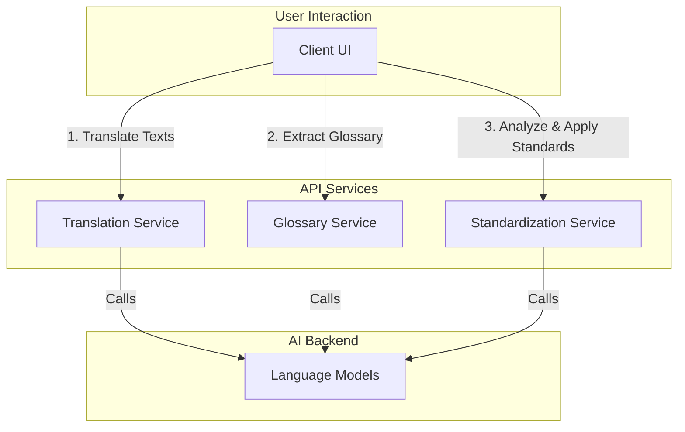

# Architectural Overview

The API is designed as a modular, multi-stage pipeline. This decoupled architecture provides flexibility, allowing users to perform simple translations, detailed glossary extractions, and complex standardizations as separate, controlled steps.

The entire system is built around three core services:

---

### 1. Translation Service

*   **Endpoints**: `/translate`, `/translate/stream`
*   **Responsibility**: This service's sole purpose is to perform high-quality translations. It takes a list of source texts and returns the translated versions.
*   **Key Features**:
    *   **Batch Aware**: It uses a "single prompt per batch" approach, providing the language model with more context to produce better, more consistent translations within a batch.
    *   **Streaming-First**: The `/translate/stream` endpoint provides real-time feedback as batches are completed.
    *   **Caching**: Caches translation results to improve performance and reduce costs on repeated requests.

---

### 2. Glossary Service

*   **Endpoints**: `/glossary/extract`, `/glossary/extract/stream`
*   **Responsibility**: To extract a detailed list of key terms and their corresponding translations from a set of already-translated texts.
*   **Key Features**:
    *   **Decoupled**: This service operates independently of the translation service. It requires a list of `TranslationResult` objects as input.
    *   **Batched Parallelism**: To handle a large number of texts efficiently, it sends prompts to the language model in parallel batches, using the `abatch` method. This provides significant speed improvements.
    *   **Streaming**: The `/glossary/extract/stream` endpoint returns a stream of events as each batch of glossary terms is extracted, allowing the UI to populate results incrementally.

---

### 3. Standardization Service

*   **Endpoints**: `/standardize/analyze`, `/standardize/apply`, `/standardize/apply/stream`
*   **Responsibility**: A powerful suite of tools for enforcing terminological consistency across a large dataset of translations.
*   **Key Features**:
    *   **Analysis (`/analyze`)**: A non-LLM, pure Python endpoint that efficiently analyzes a dataset to find source terms that have been translated in multiple, inconsistent ways.
    *   **Application (`/apply`)**: A sophisticated LLM-based endpoint that takes a list of standardization rules (e.g., "always translate 'bodhicitta' as 'mind of enlightenment'") and intelligently re-translates *only the affected sentences* to enforce these rules.
    *   **Minimal Change Prompting**: The re-translation prompt is carefully engineered to instruct the model to make the *minimum necessary changes*, preserving the quality of the original translation.
    *   **Streaming (`/apply/stream`)**: The application process can be fully streamed, allowing the user to watch in real-time as the translations are corrected one by one.

This modular design ensures that each part of the system is focused, efficient, and independently usable. 